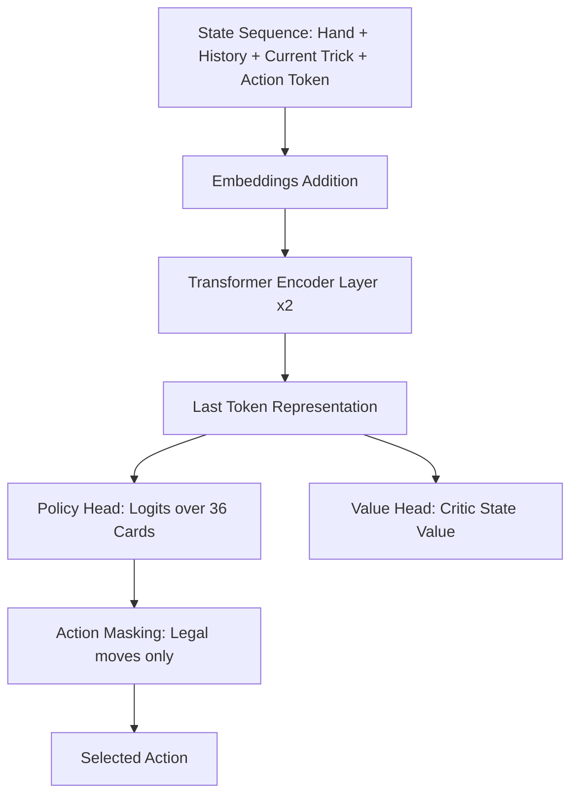

# Python Jass Bots & JassTransformer

A comprehensive project featuring multiple Python-based Jass bots that connect to the `jass-server` using WebSockets. They participate in the Jass Challenge tournament sessions alongside JVM-based bots like JassTheRipper.

This repository implements three bots:
1. **Random Bot**: Chooses valid cards randomly.
2. **Rule-Based Bot**: Implements basic Jass playing rules and heuristics.
3. **Transformer Bot (`JassTransformer`)**: A state-of-the-art neural network player trained via reinforcement learning (PPO) using a bidirectional Transformer backbone.

---

## Architecture of `JassTransformer`

The `JassTransformer` (implemented in [`transformerbot/model.py`](file:///home/steinerob/Projects/jass/JassTransformer/transformerbot/model.py)) is a PyTorch-based Deep Reinforcement Learning model. It represents the Jass game state as a sequence of tokens and processes them using a Transformer Encoder.



### 1. State Representation & Embeddings
Jass is an imperfect information game. The bot represents the state of a round as a sequence of events. The sequence consists of:
* **Hand Cards**: Pre-loaded at the start of the sequence.
* **Trick History**: Every card played in historical tricks, who played it, and trick score differences.
* **Current Trick**: Cards currently on the table.
* **Action Token**: A dummy token at the end of the sequence representing the decision point.

Each token in the sequence combines multiple aspects of information by adding their respective embeddings:
* **Card Embedding (`card_embed`)**: Maps the card's suit and rank (0 to 35) or padding/hidden tokens to `embed_dim` (128).
* **Player Embedding (`player_embed`)**: Represents the relative seat of the player who played the card (0: Self, 1, 2, 3).
* **Trick Embedding (`trick_embed`)**: Represents the trick index (0 to 8, or 9 for hand cards).
* **Turn Embedding (`turn_embed`)**: Represents the order the card was played within the trick (0 to 3, or 4 for hand cards).
* **Mode Embedding (`mode_embed`)**: Represents the chosen game mode (OBEABE, UNDEUFE, or Trump suit).
* **Score Embedding (`score_embed`)**: Encodes the score differential of each trick.

### 2. Transformer Backbone
* **Type**: `nn.TransformerEncoder`
* **Parameters**: 2 layers, 4 attention heads, embedding dimension of 128, feedforward dimension of 512, and 10% dropout.
* It uses **bidirectional self-attention** over the entire hand card and play history to build a holistic representation of the game context.

### 3. Dual Heads & Action Masking
* **Policy Head**: Predicts a probability distribution over the 36 possible cards.
* **Action Masking**: To prevent illegal card plays, a mask is applied to the raw policy logits. Illegal card moves are forced to `-1e9` prior to the softmax calculation.
* **Value Head**: Evaluates the expected return/advantage of the current state for reinforcement learning updates.

---

## Reinforcement Learning Environment & Training

The training suite includes a custom Swiss Jass simulator and two reinforcement learning training pipelines.

### Custom Jass Environment (`JassEnv`)
Located in [`transformerbot/env.py`](file:///home/steinerob/Projects/jass/JassTransformer/transformerbot/env.py), this simulator models:
* Dealing cards and setting game modes.
* Standard rules of Swiss Jass (must follow suit, trump play rules like Undeufe/Obeabe ranking, Trumpf-Buur and Nell rules, and last-trick bonuses).
* Step rewards (score differentials) and terminal rewards (extra +50/-50 points for winning the round).

### Training Modes (PPO)
1. **Self-Play (`trainselfplay.py`)**:
   * Trains the model against historical checkpoints of itself.
   * Maintains an opponent pool to prevent strategy collapse and ensure robust training.
2. **Vs. Rule-Based Bot (`trainvs.py`)**:
   * Trains the model against the `RuleBasedBot`.
   * Essential for bootstrapping the agent with basic competitive Jass gameplay strategies.

---

## Setup & Installation

1. Install PyTorch (with CUDA support if available) and other dependencies:
   ```bash
   pip install -r requirements.txt
   ```

---

## Running the Bots

To connect a bot to the tournament server:

```bash
# Run the Random Bot
python3 -m randombot.bot --url ws://localhost:3000 --name "PythonRandomBot" --team 1

# Run the Rule-Based Bot
python3 -m rulebasedbot.bot --url ws://localhost:3000 --name "PythonRuleBasedBot" --team 1

# Run the Transformer Bot
python3 -m transformerbot.bot --url ws://localhost:3000 --name "PythonTransformerBot" --team 1

```

These commands will connect the bots to the jass server and run them in the current tournament.


### Arguments:
* `--url`: The WebSocket URL of the `jass-server` (default: `ws://localhost:3000`).
* `--name`: The player name displayed in the tournament (default: `PythonRandomBot` / `PythonTransformerBot`).
* `--team`: The team index, either `0` or `1` (default: `1`).

---

## Training the Transformer Bot

To launch training, run either of the training scripts:

```bash
# Train using PPO Self-Play
python3 -m transformerbot.trainselfplay

# Train against the Rule-Based Bot
python3 -m transformerbot.trainvs
```
Checkpoints will be saved as `jass_transformer_v<iteration>.pt` and the latest model will be saved as `jass_transformer.pt` under `transformerbot/`.

